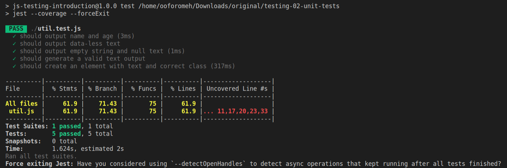
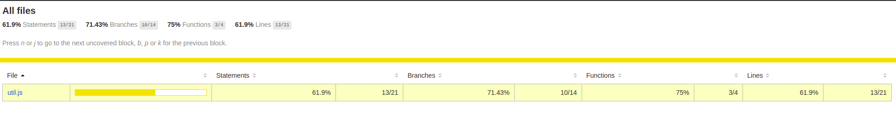

# test-javascriptApp-using-jest-and-puppeteer

## How to Run
the tests and visualize them on the terminal and the browser

### What is the project about in a nutshell:
Being inspired by the udemy course [JavaScript - The Complete Guide 2020](https://www.udemy.com/course/javascript-the-complete-guide-2020-beginner-advanced) I have enriched the [Section 31: Introduction to Testing](https://www.udemy.com/course/javascript-the-complete-guide-2020-beginner-advanced/learn/lecture/16677242#overview) with the testing-coverage-report provided by Jest.

### How to run the project
Open the terminal and run:
1. npm install
2. npm start
3. npm test

### How to see the coverage
1. At the terminal you need to see the report of the testing coverage. It is provided by Jest (check package.json).

2. A new folder, named "coverage" will be created (refresh if you don't see it). Open in the browser the index.html file (/coverage/lcov-report/index.html). Click on the file to see the lines of the code-base not covered.

